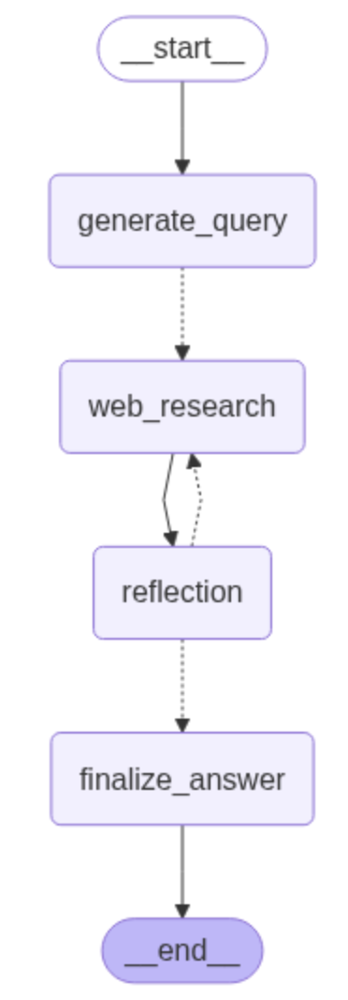

# Deep Research




The graph's share state called `OverallState` and is defined as per below:

```Python

class OverallState(TypedDict):
    messages: Annotated[list, add_messages]
    search_query: Annotated[list, operator.add]
    web_search_results = Annotated[list, operator.add]
    sources_gathered = Annotated[list, operator.add]
    initial_search_query_count: int
    max_research_loops: int
    research_loop_count: int
    reasoning_model: str
```

State is one of the core components of LangGraph. A node takes state as input, updates it and
pass it to the next node in the graph. To better define a graph, sometimes it is convenient to 
configure it when calling it. For example, we might want to configure the LLLs inside the graph. 
The proposed graph is isung the following configuration:

```python
builder = StateGraph(OverallState, config_schema=Configuration)
```


### Graph Nodes

1. The first node in the graph is `generate_query`, whose role is to generate a search query 
based on the User's questions. For example,

  ```python
  Topic: What revenue grew more last year apple stock or the number of people buying an iphone
  ```json
  {{
    "rationale": "To answer this comparative growth question accurately, we need specific data points on Apple's stock performance and iPhone sales metrics. These queries target the precise financial information needed: company revenue trends, product-specific unit sales figures, and stock price movement over the same fiscal period for direct comparison.",
    "query": ["Apple total revenue growth fiscal year 2024", "iPhone unit sales growth fiscal year 2024", "Apple stock price growth fiscal year 2024"],
  }}
  ```

So, the `generate_query` node returns a list of queries:

```python
return {"query_list": result.query}
```

2. The second node called `web_search` sends the search queries to the web research node. A `conditional_edge` is added between
   `generate_query` and `web_search`, and the function called `continue_to_web_research` (which is part of the graph) that sends the search queries 
   to the `web_research`. This is used to spawn n number of web research nodes, one for each search query.
   
```python
def continue_to_web_research(state: QueryGenerationState):
    """LangGraph node that sends the search queries to the web research node.

    This is used to spawn n number of web research nodes, one for each search query.
    """
    return [
        Send("web_research", {"search_query": search_query, "id": int(idx)})
        for idx, search_query in enumerate(state["query_list"])
    ]
```

   The state of the `continue_to_web_research` is:

```python
class QueryGenerationState(TypedDict):
    query_list: list[Query]
```

which matches with the output schema of the previous node in the graph: `generate_query`. The output 
schema of the `continue_to_web_research`

